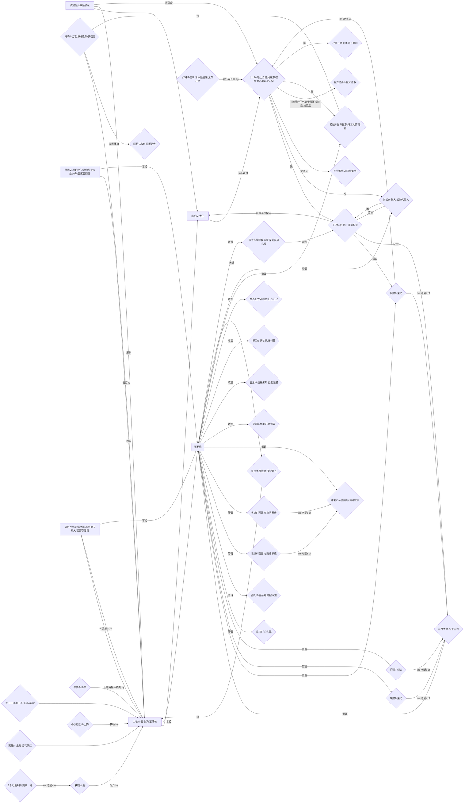

style I stroke-dasharray: 5 5
style K stroke-dasharray: 5 5
style L stroke-dasharray: 5 5
style Z stroke-dasharray: 5 5
style AB stroke-dasharray: 5 5
style AI stroke-dasharray: 5 5
style P stroke-width: 10
style B stroke-width: 10
%% 关系全景图 V2.2 传播/修改本源码需遵守MIT协议